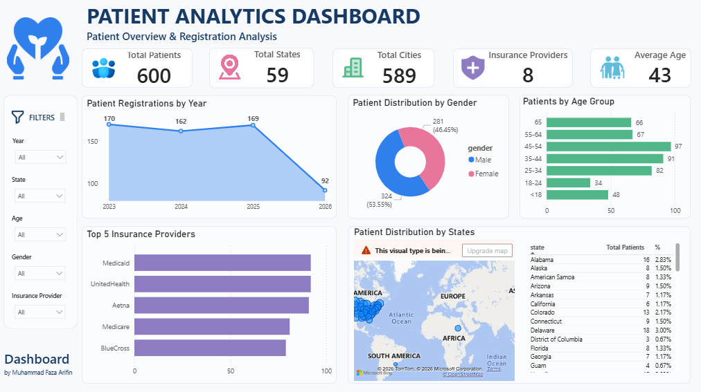

# Healthcare Patient Data Analysis

> End-to-end Patient Demographics, Insurance &amp; Registration Analysis

> SQL • DuckDB • Power BI • Data Cleaning • EDA
---

## **Project Overview**

This project focuses on cleaning, validating, analyzing, and visualizing healthcare patient data to generate meaningful insights into patient demographics, insurance providers, geographic distribution, and registration trends.

The project follows an end-to-end data analytics workflow, starting from raw data profiling and cleaning using DuckDB and SQL, followed by exploratory data analysis and visualization using Power BI.

## **Objectives**

- Identify data quality issues in the raw healthcare dataset.
- Clean and standardize inconsistent patient information.
- Validate the cleaned dataset.
- Perform exploratory data analysis (EDA).
- Analyze patient demographics and insurance distribution.
- Analyze patient registration trends.
- Build an interactive Power BI dashboard.
- Present meaningful insights from the cleaned data.

## **Dataset**

The dataset contains approximately 600 synthetic patient records.

The main attributes include:
| Category     | Attributes                 |
| ------------ | -------------------------- |
| Patient      | Patient ID, Full Name      |
| Demographics | Gender, Date of Birth, Age |
| Contact      | Phone, Email               |
| Location     | State, City, ZIP Code      |
| Insurance    | Insurance Provider         |
| Registration | Registration Date          |

## Tools & Technologies
- DuckDB — Data profiling, cleaning, and validation
- SQL — Data transformation and quality checks
- Power Query — Additional transformation and validation
- Power BI — EDA, visualization, and dashboard development
- GitHub — Project documentation and version control

## Project Workflow
```
Raw Dataset
     ↓
Data Profiling
     ↓
Data Qulity Audit
     ↓
Data Cleaning
     ↓
Data Validation
     ↓
Exploratory Data Analysis
     ↓
Data Visualization
     ↓
Power BI Dashboard
     ↓
Insights
     ↓
Project Structure
     ↓
Skills Demonstrated
     ↓
Conclusion
```
---
## 1. Data Cleaning
he raw dataset contained several data quality issues, including:

- Missing values
- Duplicate records
- Duplicate patient IDs
- Inconsistent gender values
- Inconsistent insurance provider names
- Inconsistent state and city formatting
- Different date formats
- Invalid date values
- Invalid email formats
- Inconsistent phone number formats
- Inconsistent ZIP code formats

### Cleaning Approach

SQL was used to standardize and transform the raw data.

Examples include:

### Gender Standardization
```
CASE
    WHEN LOWER(TRIM(gender)) IN ('m', 'male') THEN 'Male'
    WHEN LOWER(TRIM(gender)) IN ('f', 'female') THEN 'Female'
    WHEN LOWER(TRIM(gender)) IN ('o', 'other') THEN 'Other'
    ELSE NULL
END AS gender
```
### Phone Number Cleaning
```
regexp_replace(
    TRIM(phone),
    '[^0-9]',
    '',
    'g'
)
```
### Email Standardization

Inconsistent values such as:
```
gmial
gamil
hotmial
outlok
```
were standardized into their corresponding email domains.

### Date Standardization

Different date formats were converted into a consistent date format using DuckDB date parsing functions such as:
```
TRY_STRPTIME()
```
and:
```
STRFTIME()
```
## 2. Data Validation

After cleaning, validation was performed to identify remaining data quality issues.

Examples of validation checks:

### Missing Values
```
SELECT
    COUNT(*) AS total_rows,
    COUNT(date_of_birth) AS non_null_dob
FROM cleaned_patients;
```
### Duplicate Records
```
SELECT *,
       COUNT(*) AS duplicate_count
FROM cleaned_patients
GROUP BY ALL
HAVING COUNT(*) > 1;
Date Validation
```
Patients whose date of birth occurred after their registration date were treated as invalid records for age analysis.
```
Date of Birth > Registration Date
              ↓
          Invalid
              ↓
       Age = NULL
```
### Age Validation

Age values below zero were excluded from demographic analysis.

## 3. Exploratory Data Analysis

EDA was conducted to understand the characteristics and distribution of the cleaned patient data.

The analysis focused on:

### Patient Demographics
- Gender distribution
- Age distribution
- Age groups
### Geographic Distribution
- Patient distribution by state
- Patient distribution by city
### Insurance
- Insurance provider distribution
- Top insurance providers
### Registration
- Patient registrations by year

## 4. Power BI Dashboard

The cleaned dataset was imported into Power BI to create an interactive dashboard.

### Dashboard Components

**KPI Cards**
- Total Patients
- Total States
- Total Cities
- Insurance Providers
- Average Patient Age

**Visualizations**
- Patient Registrations by Year
- Patients by Gender
- Patients by Age Group
- Top 5 Insurance Providers
- Patients by State

**Filters**
- Year
- State
- Age
- Gender
- Insurance Provider

**Dashboard Preview**


## 5. Key Insights

- Patient registrations remained relatively stable from 2023 to 2025, averaging around 167 patients annually, while 2026 showed a lower volume that may reflect incomplete-year data.
- Female patients slightly outnumbered male patients, representing approximately 54% of the patient population.
- Patients aged 45–54 formed the largest age group, indicating a relatively high concentration of middle-aged patients.
- Patients were geographically diverse, covering 59 states and 589 cities, with Medicaid and UnitedHealth among the leading insurance providers.

## 6. Project Structure

```
healthcare-patient-analysis/
│
├── data/
│   ├── patients_easy.csv
│   └── cleaned_patients.csv
│
├── sql/
│   ├── 01_profiling.sql
│   ├── 02.quality_audit.sql
│   ├── 03.cleaning.sql
│   ├── 04.validation.sql
│   └── 05.eda.sql
│
├── powerbi/
│   └── patient_analytics_dashboard.pbix
│
├── images/
│   └── patient-analytics-dashboard.png
│
└── README.md
```
## 7. Skills Demonstrated

- SQL
- DuckDB
- Data Cleaning
- Data Profiling
- Data Validation
- Exploratory Data Analysis
- Power Query
- Power BI
- Data Visualization
- Data Quality Management
- Data Storytelling

## 8. Conclusion
This project demonstrates an end-to-end data analytics workflow, from
raw data profiling and cleaning to exploratory analysis and dashboard
development.

Using DuckDB and SQL, various data quality issues were identified and
addressed before the data was analyzed in Power BI. The resulting
dashboard provides an overview of patient demographics, insurance
providers, geographic distribution, and registration trends.

The project strengthened my practical experience in SQL, data
cleaning, data validation, exploratory data analysis, and Power BI
visualization, while also demonstrating the importance of making
appropriate data quality decisions before generating insights.


---

### 👤 Author
Muhammad Faza Arifin
